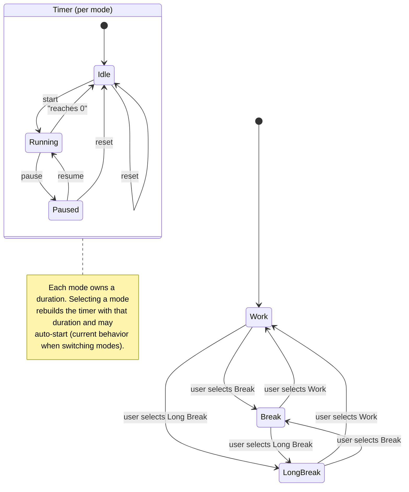

## Product Requirements Document (PRD) — Focus Flow Pomodoro

### 1. Overview
Focus Flow Pomodoro is a minimalist, offline-capable Pomodoro timer built with SolidJS and Vite. It helps users structure focused work using three modes: Work, Break, and Long Break. The UI is intentionally simple and keyboard-friendly, with a central time display, mode tiles, action tiles (Pause/Resume, Reset, Config), and a modal to configure session lengths.

### 2. Goals
- Provide a distraction-free, reliable Pomodoro timer.
- Support fast switching between Work/Break/Long Break.
- Allow editing of default durations with safe input handling.
- Maintain responsiveness and accessibility (keyboard and screen reader friendly).
- Work offline as a lightweight PWA.

### 3. Non‑Goals
- Accounts, cloud sync, or multi-device state.
- Detailed analytics or history.
- Complex workflows (task lists, projects, integrations).

### 4. Target Users
- Students and professionals needing time-boxed focus sessions.
- Users who prefer quick setup and minimal UI.

### 5. User Stories
- As a user, I can start/pause/resume a timer for the current mode.
- As a user, I can switch between Work, Break, and Long Break modes at any time.
- As a user, I can reset the current timer back to the configured duration.
- As a user, I can configure durations (in minutes) for all modes and save them.
- As a user, I can operate the app without network connectivity.
- As a user, I get a clear, readable time display and current mode indicator.

### 6. User Flows

### 7. Functional Requirements
- Modes
  - Three modes: `work`, `break`, `longBreak`.
  - Default durations: 25/5/15 minutes (configurable).
  - Selecting a mode replaces the current timer and auto-starts if duration > 0.

- Timer Controls
  - Start/Pause/Resume toggle.
  - Reset sets remaining time back to the mode’s configured duration.
  - When remaining time reaches 0, timer stops automatically.

- Configuration Modal
  - Change durations in minutes for all modes.
  - Inputs accept integers from 1 to 120, sanitized on submit: round and clamp ≥ 1.
  - Escape closes modal (cancel). Clicking backdrop cancels.
  - Save persists for session and rebuilds timer for the active mode.

- Accessibility
  - `aria-live="polite"` time display with atomic updates.
  - Buttons have visible labels and icons set to presentation.
  - Escape key handling for modal; focus management remains simple due to modal overlay.

- PWA
  - App builds as a static site; uses Vite PWA plugin for installability and offline caching.

### 8. Non‑Functional Requirements
- Performance: Immediate UI response; 1s interval accuracy; minimal re-renders via Solid signals/memos.
- Reliability: Timer interval cleared on pause/dispose; safe rebuild on mode switch.
- Maintainability: Componentized UI (`TimerDisplay`, `TileButton`, `ConfigModal`), `useTimer` hook encapsulates timer logic.
- Portability: No backend; deployable to any static host.

### 9. Current Architecture (from code)
- Stack: SolidJS (`solid-js`), Vite, `vite-plugin-solid`, `vite-plugin-pwa`.
- Entry: `src/index.tsx` renders `App`.
- State
  - `App` owns: active mode, durations, a `TimerHandle` created via `useTimer` within `createRoot` for easy disposal on replace.
  - `useTimer(initialSeconds)` provides `time`, `isActive`, `start`, `pause`, `reset` using `setInterval` and `createEffect` cleanup.
- UI
  - `TimerDisplay`: large mm:ss, polite live region.
  - `TileButton`: mode tiles and action tiles with consistent styling.
  - `ConfigModal`: portal-backed modal with numeric inputs and sanitize/submit logic.

### 10. Edge Cases & Behaviors
- Start when time is 0: replaces timer with active mode’s duration and starts (from App logic).
- Switching modes mid-run: pauses and disposes current timer, constructs new timer at selected mode’s duration, and auto-starts.
- Reset during pause or run: resets remaining time to initial; stays paused if paused.
- Modal open while running: opening modal pauses the timer.

### 11. Open Questions
- Should durations persist across sessions (localStorage)? Currently session-only.
- Should there be an audible or visual alert at 00:00?
- Auto-advance to next mode on completion (work -> break -> work ...)? Currently manual.
- Mobile vibration/haptics on state changes?

### 12. Future Enhancements (Nice-to-haves)
- Persistence: Save durations and last active mode in localStorage.
- Notifications: Web notifications on session end; optional sound.
- Auto-advance cycles with configurable sequence (e.g., 4 work cycles -> long break).
- Keyboard shortcuts (space to toggle, 1/2/3 to select modes, r to reset, s to settings).
- Theming: Dark/light themes and custom accent color.
- Accessibility: Focus trap within modal, initial focus placement, labeled close button.

### 13. Acceptance Criteria
- Selecting a mode updates the chip label and starts a fresh timer for that mode.
- Pause/Resume toggles label and icon appropriately; timer ticks once per second when running.
- Reset returns display to the configured minutes for the active mode.
- Config modal: entering valid numbers and saving updates durations; Escape/backdrop cancels and restores previous values.
- Works offline when installed as a PWA; loads without network.
- No console errors in modern browsers; layout is responsive down to 320px width.

### 14. QA Test Cases (sample)
- Initial load shows Work mode and 25:00.
- Switch to Break: chip shows Break, timer runs from 05:00.
- Pause at 24:55 -> time stops; Resume -> time continues.
- Reset during pause -> returns to full duration, remains paused.
- Open Config, set Work=30, Break=10, Long Break=20, Save -> active mode duration updates and timer is rebuilt.
- Enter invalid inputs (e.g., 0, -5, 1.7, text) -> sanitized to integer ≥ 1 on Save.
- Press Escape with modal open -> closes without saving.
- Let timer reach 00:00 -> stops automatically.

